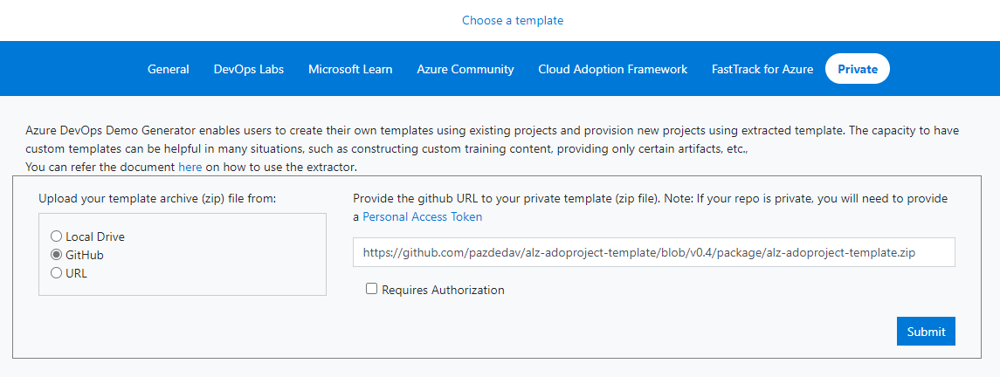

# Azure DevOps template for Enterprise Scale Landing Zone

## Overview

This repo contains a **project template** for Azure DevOps [Demo Generator](https://azuredevopsdemogenerator.azurewebsites.net/environment/createproject) helping organizations implement **Enterprise Scale Landing Zome** based on Cloud Adoption Framework [guidance](https://docs.microsoft.com/en-us/azure/cloud-adoption-framework/ready/enterprise-scale/).

## Instructions

1. Go to the **Azure DevOps Demo Generator** [website](https://azuredevopsdemogenerator.azurewebsites.net/).
2. Click "Sign In" button and use your Azure AD credentials with access to your Azure DevOps organization. If you do not have a DevOps organization yet, you could [create one](https://app.vsaex.visualstudio.com/).

3. Click "Choose template" button.

4. Select "Private" category and "GitHub" as a source.

5. Enter the following URL: `https://github.com/pazdedav/eslz-adoproject-template/v0.1/package/eslz-adoproject-template.zip` (where `v0.1` represents the tag / version) you want to use and click "Submit". _Note: It is recommended to use the latest version._

6. Use the "Select organization" drop-down menu and select your DevOps organization, where you want to create your new ESLZ project. Enter the name of your project.

7. You might be prompted with the following required extensions

8. Scroll to the bottom and click "Create Project".

Update bar like below will start

